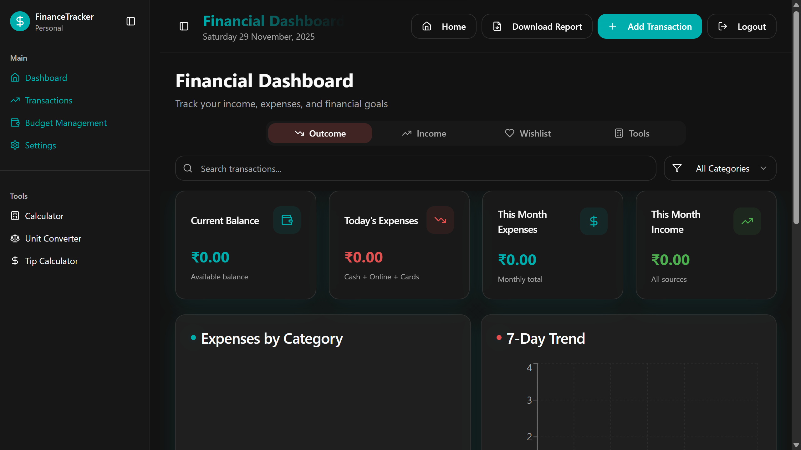
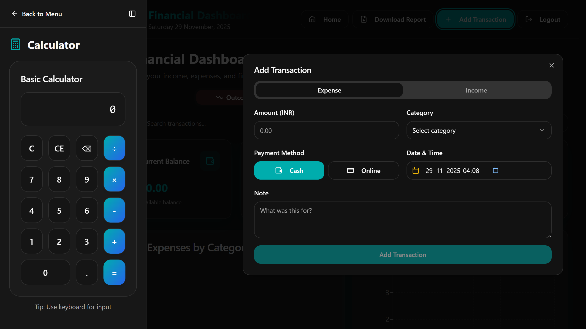
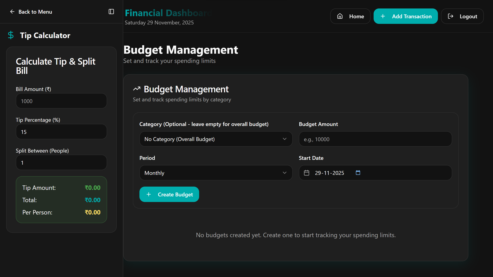

  
  
  <h1>FinanceTrack</h1>
  
Modern, personal daily finance tracker with budgets, goals, and tools.

## Why I Built This
- I wanted a simple, reliable way to track all my finances in one place.
- My vision is to monitor income, expenses, budgets, and goals with a clean, responsive UI.
- I built this to track my entire financial life — from quick daily spends to monthly budgets and savings goals.

## How It Helps The World
- Encourages financial awareness and discipline with real‑time insights.
- Reduces friction for personal bookkeeping by offering a fast “Add Transaction” flow.
- Supports budget planning and goal‑oriented saving for anyone, anywhere.
- Provides exportable reports to share or archive your financial snapshot.

## Author
- I am Priyam Tagadiya — happy to welcome your contributions!
- Connect on LinkedIn: https://tinyurl.com/57puhd8m

## Screenshots
> Place these files inside `public/screenshots/` and keep the same names.

## Core Features
- Interactive dashboard showing balance, expenses, and income together.
- Real‑time current balance based on all recorded transactions.
- Today’s expense summary (cash, online, cards).
- Monthly expense tracking with clear monthly total.
- Monthly income tracking across all sources.
- Filterable transactions list with search and category filters.
- Recent transactions section to quickly review latest activity.

## Budget & Goals
- Budget management to plan and control monthly spending.
- Category‑wise expenses to understand where money goes.
- Simple goal‑oriented view to support savings and wishlist planning.

## Built‑In Tools
- In‑app standard calculator.
- Unit converter for common conversions.
- Tip calculator to instantly calculate tips and split bills.

## UX & Productivity
- Clean sidebar navigation for Dashboard, Transactions, Budget Management, and Settings.
- Quick “Add Transaction” action from the dashboard.
- Download report option to export your financial snapshot.
- Search bar to instantly find specific transactions by text or category.
- Responsive, modern UI optimized for personal daily finance tracking.

## Extra Highlights (from codebase)
- Report generator with custom filters and PDF export (`src/components/dashboard/ReportDownloadDialog.tsx`).
- Feature management UI with toggles (`src/components/dashboard/admin/FeaturesManager.tsx`).
- Category management for custom transaction types (`src/components/dashboard/admin/CategoryManager.tsx`).
- Robust budget alerts including enhanced period checks (`src/components/dashboard/EnhancedBudgetAlerts.tsx`).

## Tech Stack
- Vite + React + TypeScript
- Supabase (Auth + Postgres + RLS)
- TanStack Query, Tailwind, shadcn/ui, recharts, lucide-react

## Setup
1. Clone and install:
   - `npm install`
2. Configure environment variables (create `.env` in project root):
   - `VITE_SUPABASE_URL=<your-supabase-url>`
   - `VITE_SUPABASE_PUBLISHABLE_KEY=<your-supabase-anon-key>`
   - Refer to `src/integrations/supabase/client.ts:5-6` for the exact names.
3. Start web app:
   - `npm run dev`
4. Optional desktop build (Electron):
   - `npm start` to run Electron using the built web output.

## Supabase Setup & Migrations
- Create a Supabase project and copy the `Project URL` and `Anon Key` into `.env`.
- Run migrations using the SQL editor:
  - Open Supabase web console → SQL → upload and run files from `supabase/migrations/`.
  - Example path on this machine: `C:\Users\Admin\Desktop\Finace\supabase\migrations`.
- The schema includes tables like `transactions`, `budgets`, `categories`, `profiles` with row level security.

## Login Credentials (Single User)
- This app uses Supabase Auth. The login form posts email/password to Supabase.
- Change or set the allowed credentials in Supabase → Authentication → Users.
- Code references for the sign‑in flow:
  - Email/password inputs: `src/pages/Login.tsx:78-100`.
  - Sign‑in call: `src/pages/Login.tsx:41-45`.
- If you want to enforce a specific default user (e.g., `priyam@email.com` / `priyam@2653`), create that user in Supabase Auth. No credentials are hardcoded in code.

## Branding & Metadata
- Project name: FinanceTrack.
- Public logo used in HTML metadata: `public/favicon.svg`.
- Social preview tags updated in `index.html` to remove generator fingerprints.

## Contributing
- Issues and PRs are welcome. Please:
  - Keep code style consistent with existing TypeScript/React patterns.
  - Avoid committing secrets; use `.env` and `.gitignore` already configured.
  - Add context in PR descriptions (what, why, screenshots if applicable).

---
Built with care by Priyam Tagadiya. Contributions are appreciated.

